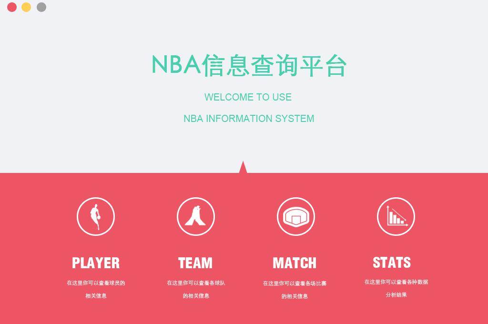
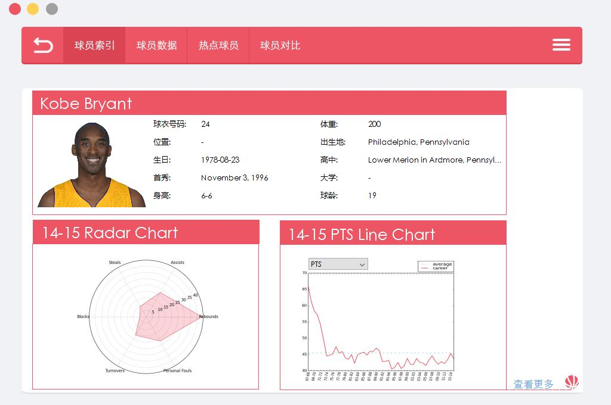
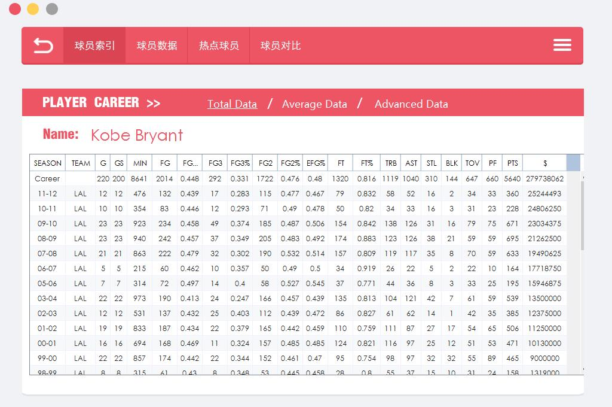
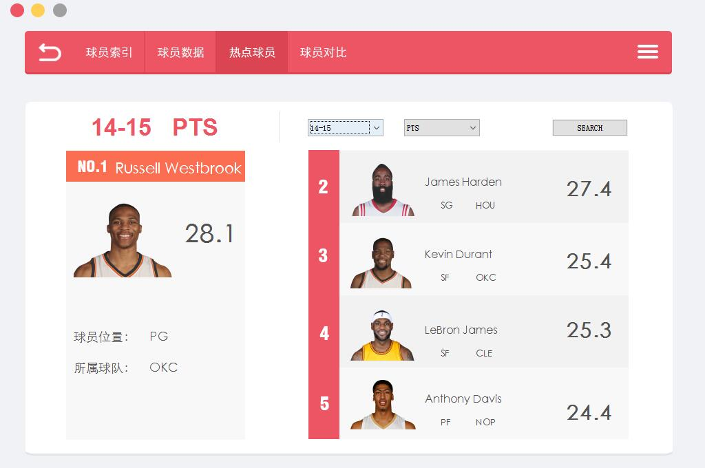
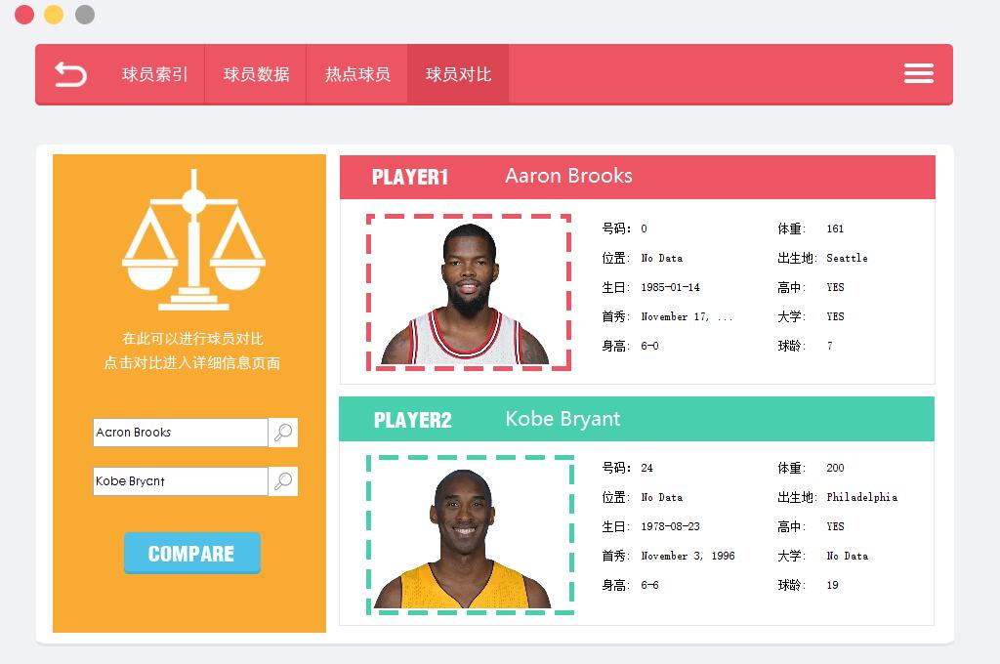
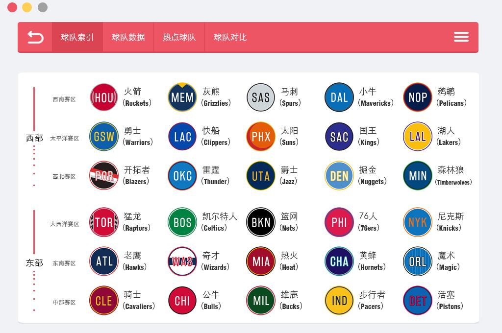
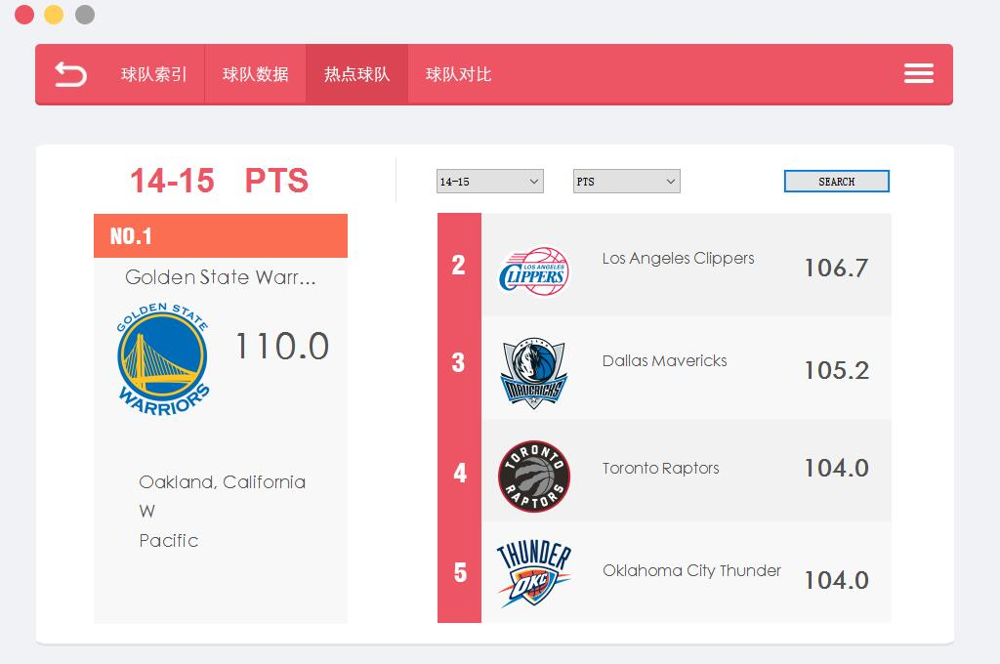
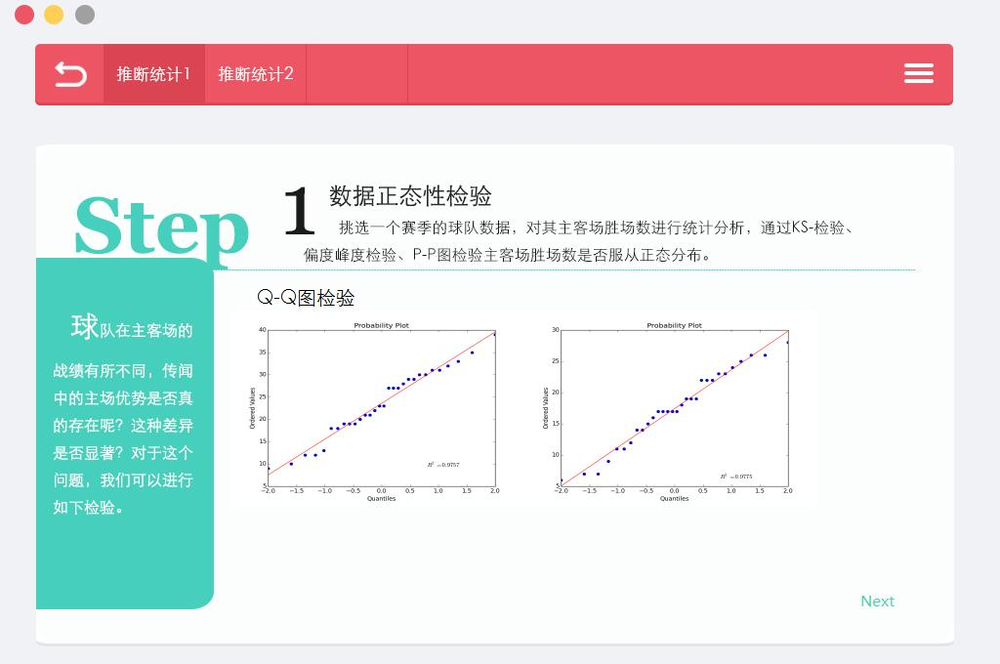
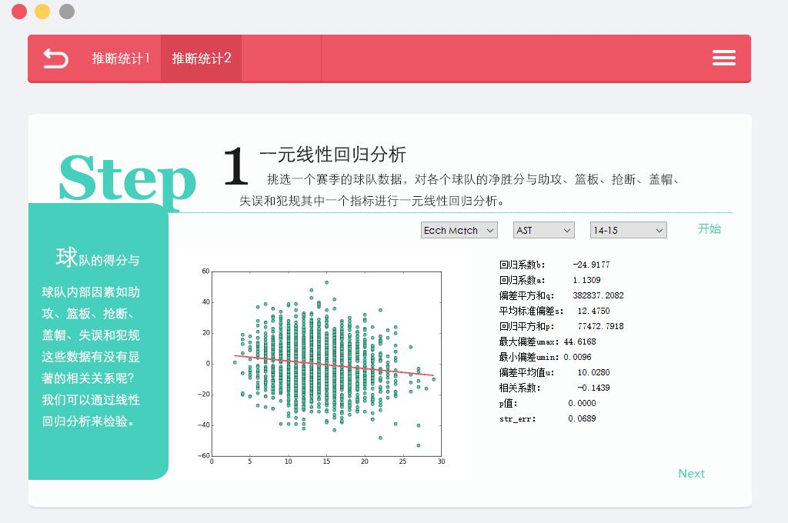

# NBA-Deworm
Deworm的软工三大作业迭代三：NBA数据采集、数据提供、数据展现、数据分析、数据同步

NBA_Scrape：数据采集

NBA_Server：数据提供、数据分析

NBA_UI：数据展现

===
开发团队：Deworm

团队成员：

- [tomato990(队座)](https://github.com/tomato990)
- [vboar](https://github.com/vboar)
- [JaneLdq](https://github.com/JaneLdq)
- [oneoneO1](https://github.com/oneoneO1)

===
UI部分截图：

